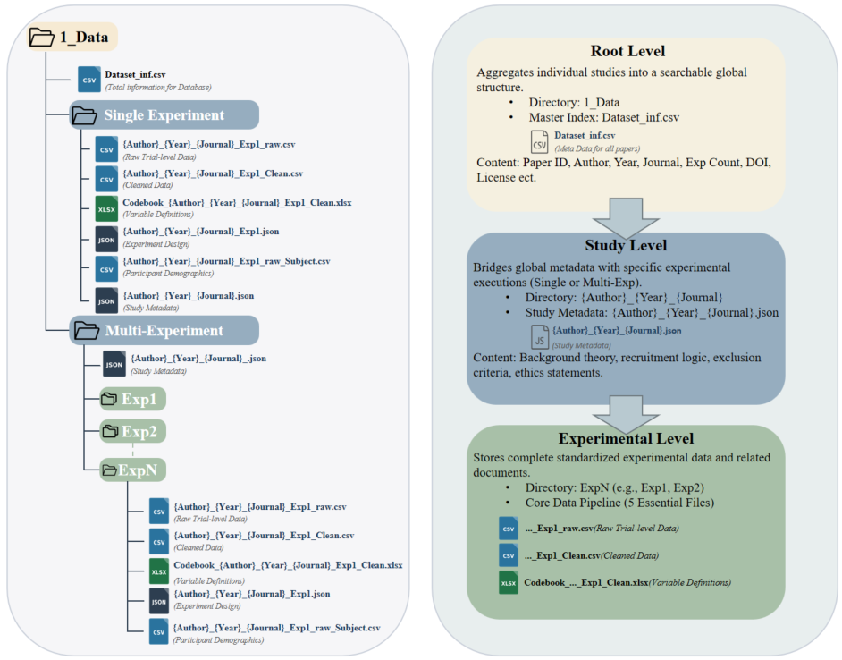
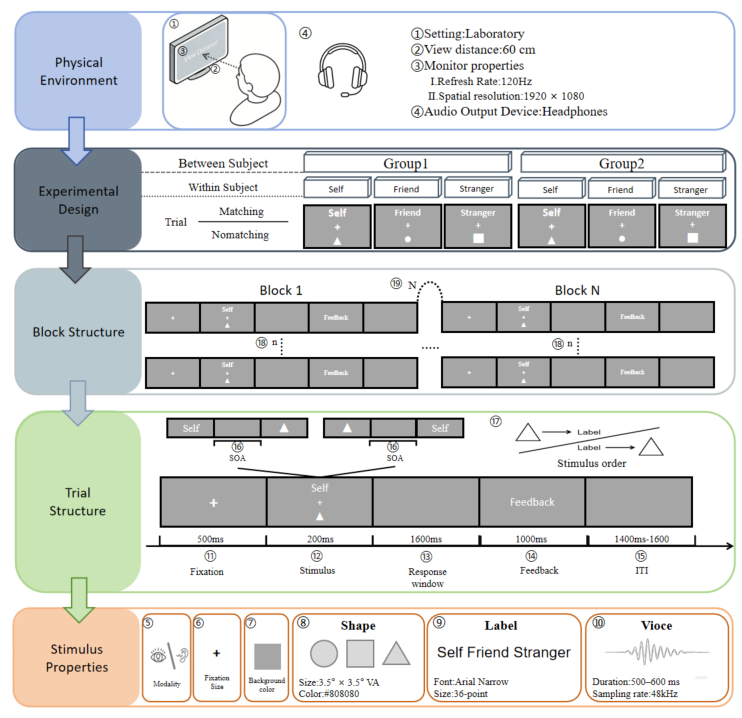
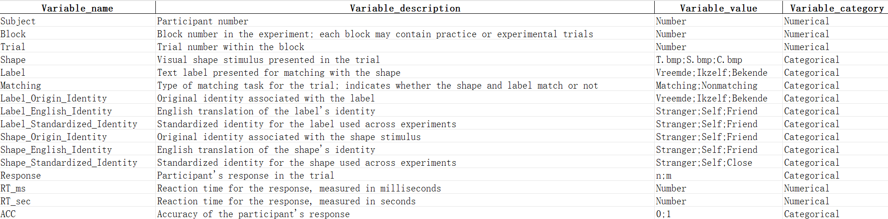
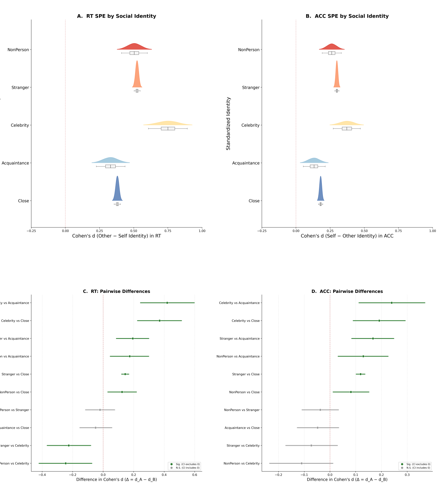
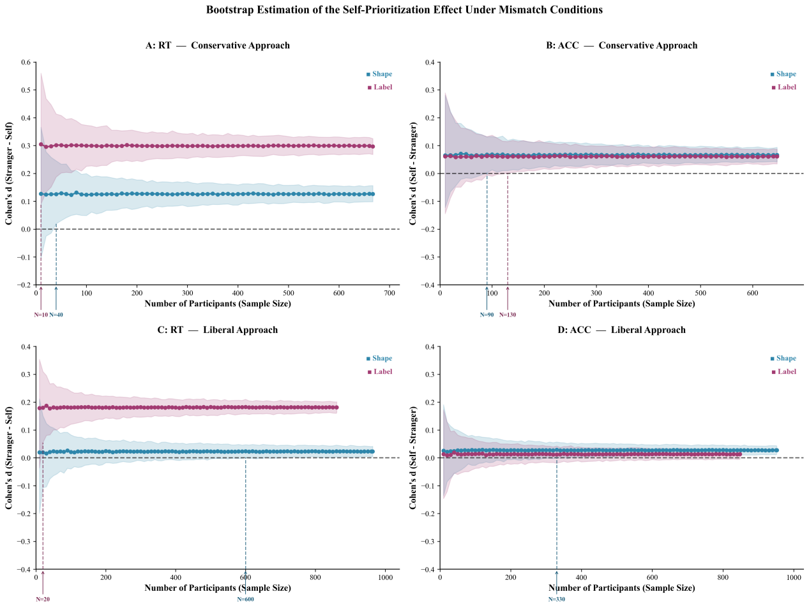
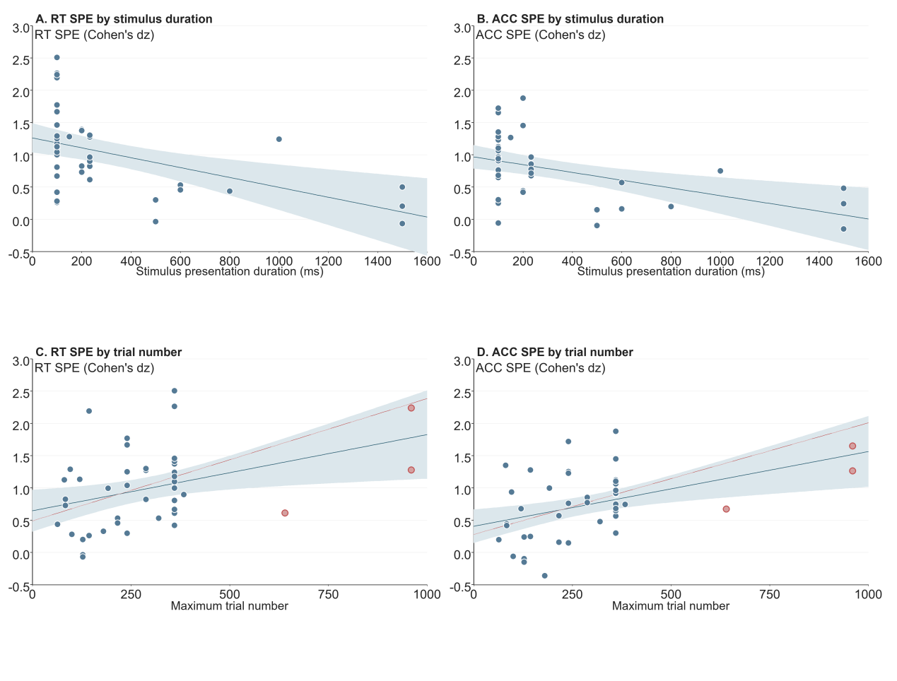

# The Self-Prioritization Effect Database with Standardized Meta-Data for Experimental Task

Cai Zhenxin^1^, Wang Qihui^1^, Tuo Liu, XXXX, Jie Sui, Hu Chuan-Peng^1*^

1 School of Psychology, Nanjing Normal University, 210024 Nanjing, China

*Email: 

# Abstract

The self-matching task is widely used to investigate self-related cognition. In a typical self-matching task, participants first learn associations between social identities (e.g., self, friend, and stranger) and neutral geometric shapes (e.g., circle, triangle, and square). They subsequently decide whether shape–identity pairings presented on the screen match the learned associations. Studies using this task usually found faster and more accurate responses to self-related pairings than to other-related pairings, a phenomenom called self-prioritization effect (SPE). Following the open science and credibility movement in psychology, many studies employing the self-matching task have made their data publicly available. However, the field lacks a standardized format for sharing trial-level self-matching data, making it difficult to reuse and integrate existing open datasets. To address this issue, we developed a three-level framework for organizing metadata and datasets from the self-matching task. Machine-readable JSON files were created to document experimental details, including experimental design, block structure, and trial structure. Based on this standard folder-structure and meta-data format, we curated a SPE database, which includes open data from 44 studies, with 70 experiments, 3,603 participants, and over 1.55 million trials. We demonstrated the value of the standardized database through three large-scale analyses: the influence of baseline conditions on SPE magnitude; the presence of a small but detectable SPE under mismatch conditions, which depends on how the effect is operationalized; the relationships between stimulus presentation duration and SPE magnitude, and between trial number and SPE magnitude. The patterns observed in all three examples could only be reliably detected using large aggregated datasets. Our database provides a valuable resource for researchers interested in the SPE, self-relevance, and cognitive psychology more broadly and self-relevance in cognitive psychology and related fields. Moreover, our standardized schema for coding the task implementation is also valuable for developing similar databases for other cognitive tasks.

**Keywords**: Self-matching task, self-prioritization effect, open data, experimental design.

# Introduction

The self plays a central role in cognition and gives rise to a robust processing advantage known as the self-prioritization effect (SPE). Specifically, self-relevant information is processed faster and more accurately across perception, attention, and memory domains (Sui et al., 2012; Schäfer, Frings, et al., 2016; Constable et al., 2019). Over the past decade, the self-matching task has emerged as a dominant paradigm for investigating the SPE. In a typical self-matching task, participant first associate neutral geometric shapes with self- and non-self-relevant labels (e.g., "I", "Friend", and "Stranger") and then judge a shape-label pair presented on the screen match the learned association or not. Studies found better performance for these stimuli associated with self- than non-self (Liu et al., 2025; Schäfer, Wesslein, et al., 2016; Sui et al., 2012). Importantly, this effect has been observed across diverse cultural contexts, with studies conducted in Western and Eastern populations showing similar patterns of self-prioritization (Constable et al., 2019; Grossmann & Jowhari, 2018). Furthermore, the phenomenon exhibits remarkable cross-modal generalizability, extending from visual perception to auditory and vibrotactile processing (Schäfer, Wesslein, et al., 2016). This consistency across different methodological approaches and participant populations underscores the fundamental nature of self-relevance as an organizing principle in human cognition (Golubickis & Macrae, 2021; Woźniak & Knoblich, 2019).

As open data practices have become increasingly recommended in psychology (Houtkoop et al., 2018; Milham et al., 2018; Munafò et al., 2017), many SPE studies have made their trial-level data publicly available, which not only increases the transparency of the study but also creates significant opportunities for data reuse. However, no standardized, large-scale dataset currently exists for the SPE. Specialized databases that aggregate data from multiple studies on particular phenomena provide unique opportunities for theory testing and discovery (Haaf et al., 2024; Rodriguez & Williams, 2022). Such resources allow researchers to examine effect sizes across diverse experimental conditions, identify moderating variables, and generate new hypotheses based on patterns that emerge only when data are aggregated across many studies (Cheung & Jak, 2016; Moreau & Gamble, 2022). The Attentional Control Data Collection (ACDC) is a good example, which provides a structured open database for attentional control experiments that has facilitated meta-analyses and methodological advancements (Haaf et al., 2024). Similarly, the Confidence Database aggregates data from hundreds of experiments on confidence judgments and meta-cognitive performance into a unified repository (Rahnev et al., 2020). The Confidence Database enabled researchers to examine individual differences, compare computational models, and investigate theoretical questions that cannot be addressed using isolated datasets (Rahnev, 2025). Together, these curated large-scale resources facilitate cumulative science by lowering barriers to data reuse and promoting reproducible research practices.

For cognitive paradigms such as the self-matching task, an additional barrier exists for re-using the open data: the lack of standardized meta-data and data organization. For example, the outcome reaction times may be named differently across studies, such as RT, Response-Time, or Latency. Also, accuracy may use inconsistent coding schemes, such as 0 vs 1, True vs False, or Correct vs Error). The name of critical independent variables, such as the social identities used in the self-matching task, may have different labels across studies. Moreover, critical methodological information (including the assignment of shapes to identities, stimulus presentation duration, trial structure, and participant exclusion criteria) is often absent from the raw data files and can only be recovered by manually consulting the corresponding publications. These inconsistencies in open data substantially increase the effort required for data integration and limit the potential for large-scale secondary analyses.

To address these issues, we developed a standardized framework for data organization and metadata documentation, upon which we curated an SPE database. To capture the methodological details systematically, we decomposed the self-matching task into multiple layers of information and documented these features using standardized metadata files. We subsequently collected all publicly available datasets and manually standardized both behavioral variables and methodological descriptors to ensure cross-study comparability. In total, data from 44 studies (70 datasets) were included, providing a comprehensive resource for researchers interested in self-prioritization phenomena. By integrating data across laboratories, participant populations, and experimental contexts, the database enables analyses that would be impossible using isolated datasets, including evaluations of effect-size robustness and investigations of how methodological variations shape self-prioritization effects.

# Method

## Database Structure

Following the FAIR principle (Wilkinson et al., 2016), we adopted a three-level hierarchical organization for the database. Each level is accompanied by standardized metadata encoded in machine-readable JSON files, facilitating both human interpretation and computational accessibility. The hierarchy consists of three organizational levels: the root level, the study level, and the experiment level.

The root level contains information spanning all studies included in the database. The study level contains information related to a specific study, defined as one or more experiments reported within a single publication, preprint, or thesis. The experimental level corresponds to an individual experimental dataset, typically representing a group of participants completing a specific version of the self-matching task across one or multiple sessions and assessment time points.

*Figure 1Database Folder Structure.*

At the root level, a master metadata file (Dataset\_inf.csv) serves as the primary index for the entire database. Each row in this file represents one study and is uniquely identified by a \`Paper\_Id\`, which is the primary key across different levels of the database. Each column corresponds to a metadata field describing the included studies, such as authors, publication year, journal name (where applicable), Digital Object Identifiers (DOIs). Importantly, we included the name of study-specific folder (\`Folder\_Name\`) for clear mapping between studies and their own folders. These study-specific folders (e.g., Amodeo\_2024\_CABN) are also stored in the root directory.

At the study level, i.e., the study-specific folder, we included a JSON file, e.g., \`Amodeo\_2024\_CABN.json\`, for the metadata of the corresponding study. JSON file were adopted because they allow flexible representation of complex study-level information such as theoretical background, participant recruitment strategies, participant recruitment procedures, as well as inclusion and exclusion criteria. Along with the JSON file, the study-specific folder also contains experiment-specific subfolders, each of which corresponds to the individual experiment reported within the the study. However, if a study contains only a single experiment, the experimental-level data are stored in the study-level folder directly.

At the Experimental level, for those studies reported more than one experiment, each experiment has its own subfolders (e.g., \`Exp1\`, \`Exp2\`). Each experimental-level sub-folder include the following files: a CSV file for participants' demographic information (e.g., Amodeo\_2024\_CABN\_Exp1\_raw\_Subject.csv), a JSON file for the experiment design (e.g., Amodeo\_2024\_CABN\_Exp1.json), a CSV file for raw trial-level behavioral data file (e.g., Amodeo\_2024\_CABN\_Exp1\_raw.csv), a CSV file for the minimally preprocessed dataset (i.e., clean data, e.g., Amodeo\_2024\_CABN\_Exp1\_Clean.csv), and an xlsx file serves as the codebook for the clean data (e.g., Amodeo\_2024\_CABN\_Exp1\_Clean.xlsx). This rule-based storage strategy ensures both structural simplicity for single-experiment studies and clear separation of data for multi-experiment publications.

To facilitate efficient data retrieval and readability, all file names include four core pieces of information —last name of the first author, publication year, journal abbreviation, and experiment identifier. Additionally, an optional fifth element specifies the content or function of the file (e.g., "\_Subject" means information related to participants, "\_raw" means unprocessed data from original studies). Together, these conventions preserve traceability between publications, experiments, and trial-level observations, thereby enhancing data interoperability and facilitating large-scale secondary analyses.

## Standardization of the task implementation

To further facilitate the re-use of the current dataset, we developed a framework for standardizing the implementation of the self-matching task. Specifically, this framework dissects the task into five core components: Physical Environment, Experimental Design, Block Structure, Trial Structure, and Stimulus Properties (Figure 2).

*Figure 2 Standardized implementation framework and five-component decomposition of the self-matching task.**

The decomposition of the self-matching task into five components roughly zooms from the enviroment of the experiment to the details of the each detail of the stimuli. These components are also important for cognitive proccesses (e.g., Gold & Shadlen, 2007; Ratchliff et al., 2016), and statistical inference for the SPE. This framework makes it possible to assign methodological variables to different components.

The Physical Environment variables describe the overall environmental conditions under which participants completed the task, including basic settings (e.g., laboratory-based vs. online administration), conditions relevant to multimodal stimulus presentation. For visual stimuli, these encompass viewing distance, monitor refresh rate, display resolution, brightness (Lin et al., 2023). For auditory stimuli, these include hardware specifications (e.g., headphones vs. speakers), sound pressure levels, and ambient noise (Kirk & Cunningham, 2025). These parameters determine how sensory information(e.g., visual or auditory signals) is physically presented to the observer but do not carry task-specific semantic content, corresponding to the sensory input stage of information processing (Bridges et al., 2020; Gold & Shadlen, 2007).

The Experimental Design level includes variables that define the inferential structure of the study, including both between-subject factors (e.g., cultural group) and within-subject manipulations (e.g., Identity and Matching conditions). What distinguishes this level from the other levels is that design variables specify *what* is being manipulated and compared for hypothesis testing, rather than *how* the task is procedurally implemented, although these aspects may occasionally overlap. This distinction is consistent with established reporting guidelines that differentiate methodological details from inferential variables (Appelbaum et al., 2018).

The Block Structure describes the structure of the task, including number of blocks as well and details within a block: trial sequencing, repetition structure, and block composition. Block Structure captures procedural organization across multiple trials and often reflects strategies used to control potential confounds. For example, trials are frequently pseudo-randomized such that more than two identical trial types are not presented consecutively.

The Trial Structure zooms in each trial and describe how each trial is implemented, including fixation duration, stimulus exposure, stimulus onset asynchrony (SOA), response window, and inter-trial interval (ITI). These parameters govern the temporal dynamics of information presentation and are closely related to cognitive mechanisms such as evidence accumulation and response preparation (Ratcliff et al., 2016).

Finally, the Stimulus Properties describe all details of the stimuli, including their modality, their visual/auditory properties, and attributes of labels. The defining boundary of this level is whether a piece of information specifies *what* information is presented rather than *how* it is physically delivered, with the latter belong to Trial Structure.

## Summary of data included in SPE database

The Self-Matching Database is hosted on the Open Science Framework (OSF) website (XXX) and Science Data Bank (XXX). At the time of publication, the database contained 44 studies with 70 datasets, aggregating 3,603 participants across 1,554,083 trials (See Table 1 for details). The database integrates data collected from both laboratory-based and online experiments.

**Table 1**

*Overview of Studies Included in the SPE Database*

| Num | ID | Study | Exp | Country | Language | N (M/F) | Stimulus | Trials | License | Exp_Implement |
| --- | --- | --- | --- | --- | --- | --- | --- | --- | --- | --- |
| 1 | P19E2 | Bukowski et al. (2021) | Exp2 | Austria | English | 111 (0/111) | geometric shape |  | CC BY 4.0 | Lab Experiment |
| 2 | P19E1 | Bukowski et al. (2021) | Exp1 | Austria | English | 111 (0/111) | geometric shape |  | CC BY 4.0 | Lab Experiment |
| 3 | P5E2 | Constable et al. (2019) | Exp4 | Hungary | English | 40 (14/14) | geometric shape | 80 | No License | Lab Experiment |
| 4 | P5E3 | Constable et al. (2019) | Exp4 | Hungary | English | 40 (14/14) | geometric shape | 80 | No License | Lab Experiment |
| 5 | P5E4 | Constable et al. (2019) | Exp4 | Hungary | English | 40 (14/14) | geometric shape | 80 | No License | Lab Experiment |
| 6 | P46E2 | Constable et al. (2019) | Exp4 | Hungary | English | 40 (14/14) | geometric shape | 80 | Not specified | Lab Experiment |
| 7 | P5E1 | Constable et al. (2019) | Exp4 | Hungary | English | 40 (14/14) | geometric shape | 80 | No License | Lab Experiment |
| 8 | P6E1 | Constable et al. (2020) | Exp1 | United Kingdom | English | 56 (25/31) | grey scale squares |  | No License | Lab Experiment |
| 9 | P46E1 | Constable et al. (2020) | Exp2 | United Kingdom | English | 56 (25/31) | grey scale squares |  | No License | Lab Experiment |
| 10 | Pu2E2 | Dalmaso et al. (2024) | Exp2 | Japan | Japanese | 40 (16/24) | face |  | CC BY 4.0 | Lab Experiment |
| 11 | Pn14E1 | Orellana-Corrales et al. (2020) | Exp1 | Germany | German | 38 (—) | geometric shape |  | No License | Lab Experiment |
| 12 | Pn4E2 | Golubickis &amp; Macrae (2021) | Exp2 | United Kingdom | English | 30 (10/20) | geometric shape | 360 | CC BY-NC-ND | Online Experiment |
| 13 | Pn4E1 | Golubickis &amp; Macrae (2021) | Exp1 | United Kingdom | English | 30 (10/20) | geometric shape | 360 | CC BY-NC-ND | Online Experiment |
| 14 | Pt1E1 | Haciahmet et al. (2023) | Exp1 | Germany | German | 40 (8/32) | geometric shape | 240 | CC BY 4.0 | Lab Experiment |
| 15 | Pt2E1 | Hobbs et al. (2023) | Exp1 | United Kingdom | English | 144 (31/112) | face | 60 | CC BY 4.0 | Lab Experiment |
| 16 | P20E1 | Hu et al. (2020) | Exp1 | China | Chinese | 46 (19/27) | geometric shape | 312 | No License | Lab Experiment |
| 17 | Ps2E1 | Hu et al. (2023) | Exp1 | China | Chinese | 23 (—) | geometric shape | 90 | On request | Lab Experiment |
| 18 | P34E1 | Kolvoort et al. (2020) | Exp1 | Netherlands | English | 31 (—) | geometric shape |  | Need Permission | Lab Experiment |
| 19 | Pt18E1 | Sui et al. (2023) | Exp1 | UK | English | 20 (—) | geometric shape |  | CC BY-NC-ND | Lab Experiment |
| 20 | Pu4E2 | Kirk et al. (2024) | Exp1 |  |  | 126 (—) | voice |  | CC BY 4.0 | Online Experiment |
| 21 | P45E1 | McIvor et al. (2021) | Exp1 | United Kingdom | English | 40 | geometric shape and face |  | CC BY 4.0 | Lab Experiment |
| 22 | Pt28E1 | Amodeo et al. (2024) | Exp1 | Belgium | Dutch | 70 | geometric shape |  | On request | Lab Experiment |
| 23 | Pu5E2 | Lee et al.(2023) | Exp2 | United Kingdom | English | 65 (—) | geometric shape/ nm. |  | CC BY 4.0 | Online Experiment |
| 24 | Pu5E1 | Lee et al.(2023) | Exp1 | United Kingdom | English | 65 (—) | geometric shape/ nm. |  | CC BY 4.0 | Online Experiment |
| 25 | Pt3E2 | Liang et al. (2021) | Exp1 | China | English | 109 (50/59) | geometric shape | 360 | CC BY-NC-ND | Lab Experiment |
| 26 | Pt3E3 | Liang et al. (2021) | Exp1 | China | English | 109 (50/59) | geometric shape | 360 | CC BY-NC-ND | Lab Experiment |
| 27 | Pt3E1 | Liang et al. (2021) | Exp1 | China | English | 109 (50/59) | geometric shape | 360 | CC BY-NC-ND | Lab Experiment |
| 28 | Ps1E1 | Liu et al. (2023) | Exp1 | United Kingdom | English | 302 (132/161) | face | 64 | On request | Online Experiment |
| 29 | Pt13E1 | Feldborg et al. (2021) | Exp1 | UK | English | 84 (—) | geometric shape and face |  | CC BY 4.0 | Online Experiment |
| 30 | Pu2E1 | Martínez-Pérez et al. (2024) | Exp1 | Japan | Spanish | 32 (5/27) | geometric shape | 240 | CC BY 4.0 | Lab Experiment |
| 31 | Pn13E2 | Navon &amp; Makovski (2021) | Exp2 | Israel | Hebrew | 26 (9/18) | geometric shape | 360 | CC0 1.0 Universal | Lab Experiment |
| 32 | Pn13E3 | Navon &amp; Makovski (2021) | Exp3 | Israel | Hebrew | 26 (9/18) | geometric shape | 360 | CC0 1.0 Universal | Lab Experiment |
| 33 | Pn13E4 | Navon &amp; Makovski (2021) | Exp4 | Israel | Hebrew | 26 (9/18) | geometric shape | 360 | CC0 1.0 Universal | Lab Experiment |
| 34 | Pn13E1 | Navon &amp; Makovski (2021) | Exp1 | Israel | Hebrew | 26 (9/18) | geometric shape | 360 | CC0 | Lab Experiment |
| 35 | Pu4E1 | Kirk et al. (2024) | Exp1 |  |  | 35 | voice |  | CC BY 4.0 | Online Experiment |
| 36 | Pu9E1 | Orellana-Corrales et al. (2020) | Exp1 | Germany | German | 36 (7/29) | geometric shape | 240 | No License | Lab Experiment |
| 37 | Pu9E2 | Orellana-Corrales et al. (2020) | Exp2 | Germany | German | 36 (7/29) | geometric shape | 240 | No License | Lab Experiment |
| 38 | Pn14E2 | Orellana-Corrales et al. (2020) | Exp2 | Germany | German | 36 (7/29) | geometric shape | 240 | No License | Lab Experiment |
| 39 | Pn14E3 | Orellana-Corrales et al. (2020) | Exp3 | Germany | German | 36 (7/29) | geometric shape | 240 | No License | Lab Experiment |
| 40 | Pu8E1 | Pan et al.(2025) |  | China | Chinese | 40(—) | geometric shape |  | Not specified | Online Experiment |
| 41 | Pt7E1 | Perrykkad et al. (2022) | Exp1 | Australia | English | 328 (—) | geometric shape | 360 | CC BY 4.0 | Online Experiment |
| 42 | P51E2 | Qian et al. (2020) | Exp2 | China | Chinese | 26 (7/19) | geometric shape | 100 | No License | Lab Experiment |
| 43 | P51E1 | Qian et al. (2020) | Exp1 | China | Chinese | 26 (7/19) | geometric shape | 100 | No License | Lab Experiment |
| 44 | P54E2 | Schäfer &amp; Frings (2019) | Exp2 | Germany | German | 35 (—) | geometric shape |  | CC-BY-SA 4.0 | Lab Experiment |
| 45 | P54E3 | Schäfer &amp; Frings (2019) | Exp3 | Germany | German | 35 (—) | geometric shape |  | CC-BY-SA 4.0 | Lab Experiment |
| 46 | P54E1 | Schäfer &amp; Frings (2019) | Exp1 | Germany | German | 35 (—) | geometric shape |  | CC-BY-SA 4.0 | Lab Experiment |
| 47 | Pu3E1 | Smith &amp; Ferguson (2024) | Exp1 | UK | English | 59 (34/46) | face |  | CC BY-NC-ND | Lab Experiment |
| 48 | Ps4E2 | Sui et al. (2014) | Exp2 | China | Chinese | 20 (—) | geometric shape | 60 | Not specified | Lab Experiment |
| 49 | Ps5E2 | Sui et al. (2014) | Exp2 | China | Chinese | 20 (—) | geometric shape | 60 | Not specified | Lab Experiment |
| 50 | Ps5E3 | Sui et al. (2014) | Exp3 | China | Chinese | 20 (—) | geometric shape | 60 | Not specified | Lab Experiment |
| 51 | Ps5E4 | Sui et al. (2014) | Exp4 | China | Chinese | 20 (—) | geometric shape | 60 | Not specified | Lab Experiment |
| 52 | Ps3E1 | Sui et al. (2014) | Exp1 | China | Chinese | 20 (—) | geometric shape | 60 | Not specified | Lab Experiment |
| 53 | Ps5E1 | Sui et al. (2014) | Exp1 | China | Chinese | 20 (—) | geometric shape | 60 | Not specified | Lab Experiment |
| 54 | Ps4E1 | Sui (unpublished) (2015) | Exp1 | China | Chinese | 21 (—) | geometric shape and face | 40 | Not specified | Lab Experiment |
| 55 | Pu6E1 | Sun et al.(2025) | Exp1 | China | Chinese | 506(—) | geometric shape |  | No License | Lab Experiment |
| 56 | Pu10E1 | Svensson et al. (2022) | Exp1 | United Kingdom | English | 25 (7/18) | geometric shape | 400 | No License | Online Experiment |
| 57 | Pn16E2 | Svensson et al. (2022) | Exp2 | United Kingdom | English | 25 (7/18) | geometric shape | 400 | No License | Lab Experiment |
| 58 | Pn16E3 | Svensson et al. (2022) | Exp3 | United Kingdom | English | 25 (7/18) | geometric shape | 400 | No License | Lab Experiment |
| 59 | Pn16E1 | Svensson et al. (2022) | Exp1 | United Kingdom | English | 25 (7/18) | geometric shape | 400 | No License | Lab Experiment |
| 60 | Pt27E2 | Martínez-Pérez et al. (2024) | Exp1 |  | Spanish | 32 | geometric shape |  | CC BY 4.0 | Lab Experiment |
| 61 | Pt6E2 | Vicovaro et al. (2022) | Exp2 | Italy | Italian | 104 (14/90) | random dots | 240 | CC BY 4.0 | Mixed (Lab + Online) |
| 62 | Pt6E1 | Vicovaro et al. (2022) | Exp1 | Italy | Italian | 104 (14/90) | random dots | 240 | CC BY 4.0 | Mixed (Lab + Online) |
| 63 | Pu1E1 | Wang et al. (2015) | Exp1 |  |  | 21 (3/18) | geometric shape |  | CC BY 3.0 | Lab Experiment |
| 64 | Pt9E2 | Wozniak_2022_PR | Exp1 |  | English | 21 (—) | geometric shape |  | CC BY 4.0 | Lab Experiment |
| 65 | Pt9E3 | Wozniak_2022_PR | Exp1 |  | English | 18 (—) | geometric shape |  | CC BY 4.0 | Lab Experiment |
| 66 | P95E2 | Wozniak_2018_PLOS | Exp2 | Australia | English | 20 (—) | face |  | CC BY 4.0 | Lab Experiment |
| 67 | P95E1 | Woźniak et al. (2018) | Exp1 | Australia | English | 20 (9/9) | face | 672 | CC BY 4.0 | Lab Experiment |
| 68 | Pt9E1 | Woźniak et al. (2020) | Exp1 | Australia | English | 18 (0/18) | geometric shape | 360 | CC BY 4.0 | Lab Experiment |
| 69 | Pn23E1 | Xu et al. (2021) | Exp1 | China | Chinese | 105 (51/54) | geometric shape | 360 | On request | Lab Experiment |
| 70 | Pt10E1 | Zhang et al. (2023) | Exp1 | China | Chinese | 380 (—) | geometric shape |  | CC BY-NC-ND | Lab Experiment |

*Note. k = number of experiments. The diversity of countries, languages, stimulus modalities, and experimental designs ensures that future re-analyses can address a broad range of scientific questions—from the robustness and generalisability of the SPE across cultures and stimulus formats, to the identification of experimental design parameters that moderate the magnitude of the effect.*

The cleaned data files contain fields that describes experimental design as well as raw data (see Figure 3). Basic information such as participant index (Subject), matching condition (Matching; matching or nonmatching), shape stimulus (Shape), label stimulus (Label), reaction time in milliseconds (RT\_ms) and seconds (RT\_sec), and response accuracy (ACC) are included in all expreiments. The manually standardised identity columns for both shape and label are also stored in data files, including the original identity names (Origin\_Identity), English-translated identity names (English\_Identity), and standardised identity categories (Standardised\_Identity: Self, Close, Acquaintance, Celebrity, Stranger, NonPerson). The data files may also include additional fields that describe the experimental design, such as block number, trial number within block, experimental phase or session, specific stimulus features (e.g., face gender, voice accent, emotional valence), and participant response keys.

***Figure 3*** *Raw codebook of experimental dataset variables*

## Example uses of the SPE Database

The Self-Prioritization Database provides a valuable resource for both methodological and theoretical investigations of self-prioritization, which enabling researcher to develop and test cognitive models of self-prioritization effects; investigate how experimental design parameters shape these effects; clarify the cross-cultural universality and cultural specificity of self-prioritization; and evaluate the robustness and generalizability of findings across laboratory-based and online settings. To demonstrate the unique value of large-scale standardized datasets, we present three examples addressing questions that cannot be adequately examined using individual studies alone.

## The Magnitude of Self-Prioritization Effect Varies Across Social Distance

The self-prioritization effect (SPE) is typically quantified as the performance difference between self-referential and other-referential conditions. However, different categories of others have been used as baseline conditions when estimating SPE magnitude. Existing studies have yielded inconsistent estimates of the self-prioritization effect (SPE) magnitude. Nevertheless, a systematic examination of how baseline selection affects SPE magnitude remains lacking. Leveraging the large-scale sample size of the SPE database, we compared the effect size of the SPE across five standardized baselines (Sun et al., 2023): Non-person, Stranger, Celebrity, Acquaintance, and Close Other. Standardized effect sizes (Cohen's *d*) were computed at the participant level by contrasting self-related trials against each baseline condition separately, using a pooled standard deviation. A linear mixed-effects model without intercept was then fitted to the participant-level Cohen's *d* values, with participants as a random intercept and data source as an additional variance component. From this model, 10,000 multivariate normal samples were drawn from the estimated fixed-effects distribution to obtain the posterior-like distributions of each identity's SPE magnitude. For consistency, we use positive values for SPE (i.e., faster reaction times or higher accuracy for self relative to other identities).

*Figure 4 Self-prioritization effects along the social distance continuum and pairwise comparisons across social identities..*

For reaction time (RT), robust SPEs were observed across all five baseline conditions, with all effect sizes significantly greater than zero (all 95% CIs excluded zero; all *ps* &lt; .001). The magnitude of the SPE differed systematically across baselines (see Figure 3). To test whether the magnitude statistically differ between SPE calculated by different baselines, we computed these effect sizes pairwisely (Δ = *d*A − *d*B) using the model-based sampling approach. We infer the difference exist if the bootstrap 95% CI does not include zero (see Figure 3C and 3D).

For RT, 8 of the 10 pairwise comparisons were statistically significant. The Celebrity-based SPE was significantly larger than that those derived from Acquaintance (Δ = 0.42, 95% CI \[0.24, 0.60\], *p* &lt; .001), Close others (Δ = 0.37, 95% CI \[0.22, 0.51\], *p* &lt; .001), Non-person (Δ = 0.25, 95% CI \[0.07, 0.42\], *p* = .006), and Strangers (Δ = 0.23, 95% CI \[0.08, 0.37\], *p* = .001). The Stranger-based SPE was significantly larger than that for Acquaintances- (Δ = 0.19, 95% CI \[0.09, 0.30\], *p* &lt; .001) and Close-other-based SPE (Δ = 0.14, 95% CI \[0.12, 0.17\], *p* &lt; .001). Similarly, the Non-person-based SPE is greater than Acquaintance- (Δ = 0.17, 95% CI \[0.05, 0.30\], *p* = .007) and Close-other-based SPE (Δ = 0.12, 95% CI \[0.03, 0.22\], *p* = .009). However, the remaining two comparison did not differ significantly: Non-person- versus Stranger-based SPE (Δ = −0.02, 95% CI \[−0.12, 0.08\], *p* = .678), and Acquaintance- versus Close-other-based SPE (Δ = −0.05, 95% CI \[−0.15, 0.06\], *p* = .348).

A similar pattern emerged for accuracy (ACC). Six of the 10 pairwise comparisons reached statistical significance. Celebrity-based SPEs were significantly larger than those derived from Acquaintance(Δ = 0.24, 95% CI \[0.11, 0.37\], *p* &lt; .001) and Close-other-based SPE (Δ = 0.19, 95% CI \[0.09, 0.29\], *p* &lt; .001); Stranger-based SPE is larger than Acquaintance- (Δ = 0.17, 95% CI \[0.08, 0.25\], *p* &lt; .001) and Close-other-based SPE (Δ = 0.12, 95% CI \[0.10, 0.14\], *p* &lt; .001); Non-person-based SPE is larger than Acquaintance- (Δ = 0.13, 95% CI \[0.03, 0.23\], *p* = .009) and Close-other-based SPE (Δ = 0.08, 95% CI \[0.01, 0.15\], *p* = .023). The remaining four pairs are not significant: Celebrity- versus Stranger (Δ = 0.07, 95% CI \[−0.03, 0.17\], *p* = .164), Celebrity versus Non-person (Δ = 0.11, 95% CI \[−0.01, 0.23\], *p* = .079), Non-person versus Stranger (Δ = −0.04, 95% CI \[−0.11, 0.03\], *p* = .298), and Acquaintance versus Close other (Δ = −0.05, 95% CI \[−0.13, 0.03\], *p* = .243).

Taken together, these findings indicate that the estimated magnitude of the SPE varies systematically as a function of the baseline condition employed. Across both RT and ACC, three tiers of SPE magnitude emerged: Celebrity stimuli elicited the strongest SPE, followed by Strangers and Non-person stimuli (which did not differ from each other), and finally Close others and Acquaintances (which also did not differ from each other). This pattern is largely consistent with the self-culture theory (Rose, 1991) and inclusion of other in the self-concept (Aron et al., 1992) in social psychology, suggesting that SPE is closely linked to the distance to the self.

## Presence of Self-Prioritization Effect Under Mismatch Conditions

Previous studies have reported inconsistent findings regarding the presence of self-prioritization effects (SPEs) under mismatch conditions. Although several studies have observed reliable mismatch SPEs (Kirk & Cunningham, 2025), others have failed to detect such effects (Desebrock & Spence, 2021; Golubickis & Macrae, 2021). One potential explanation for these inconsistencies is that mismatch SPEs are substantially smaller than matching SPEs and therefore require larger samples to be detected reliably.

Leveraging the large sample size of the current database (72 experiments, 853,015 mismatch trials, 1,676 participants), we estimated the SPE using a bootstrap resampling approach (500 iterations per sample size, with replacement) that allows evaluation of effect size stability across increasing sample sizes. Recall that in the self-matching task, each trial presents a shape–label pair. Thus, for matching trials, the shape and label are congruent (e.g., a shape previously associated with "Self" paired with the word "Self"), making the distinction between self-related and other-related trials straightforward. For **mismatch conditions** (also referred to as *incongruent* or *mismatching* trials), however, the shape and label convey conflicting identity information (e.g., a shape for "Self" paired with the word "Stranger"), creating difficulty in defining what constitutes a "Self" trial.

To address this ambiguity, we adopted two alternative operationalizations of the self-prioritization effect (SPE) under mismatch conditions: shape-based SPE or label-based SPE. **The shape-based SPE is the difference** between trials where the shape is "Self" and the label is non-Self and trials where the shape is non-self condition(s) and the label does not match the shape. The **label-based SPE** is difference between trials where the label is "Self" and the shape is non-self and trials where the label is non-self condition(s) and the shape does not match the label.

Critically, neither the shape-based nor the label-based operationalization guarantees a clean self versus non-self contrast, because mismatch trials classified as "non-self" may still contain self-referential information. For example, in an experiment includes only two identities, Self and Stranger, the mismatching trials are either "Self(shape)-Stranger(label)" or "Stranger(shape)-Self(label)". Under both conditions, part of the information is self-related, making it impossible to construct a contrast between self-related and pure non-self. Thus, a clean self versus non-self contrast becomes feasible only in experiments involving three or more identities. For example, under the shape-based operationalization, self-related trials can be defined as "Self(shape)-Other1(label)/Other2(label)" whereas non-self trials can be defined as "Other1(shape)-Other2(label)". In this case, the comparison trials contain no self-referential information, thereby providing a stringent estimate of mismatch SPEs.

To fully exploit the available datasets while preserving interpretability, we implemented both conservative and liberal approach for estimating the SPE for mismatching trials. The **conservative approach** prioritized clean self versus non-self contrasts. Accordingly, only experiments involving at least three distinct identities were eligible for inclusion. At the trial level, additional filtering procedures were applied. For shape-based SPE, mismatch trials in which the shape corresponded to a non-self identity but the label referred to the Self were excluded. Conversely, for label-based SPE, trials in which the label corresponded to a non-self identity but the shape was associated with the Self were removed. Using these criteria, 63 experiments were included in the conservative analyses. The final datasets comprised 303, 331 trials for the shape-based SPE and 199,271 trials for the label-based SPE.

In contrast, the **liberal approach** maximized statistical power and dataset coverage by retaining all eligible experiments and mismatch trials regardless of the presence of residual self-referential information in the comparison condition. To ensure a fair comparison between shape-based and label-based SPE for mismatching trials, we aligned sample-size by using the minimum *N* of the shape- and label-based SPE for both approaches (see table 3 for the included sample size and number of trials for different approaches).

*Figure 5 Bootstrap estimation of the self-prioritization effect under mismatch conditions. A and B, the conservative approach; C and D, the liberal approach.**

**Table 3** 

*Summary of Liberal Approach Results*

|  | Measure | Dimension | N Max | Cohen's d | 95% CI | N min |
| --- | --- | --- | --- | --- | --- | --- |
| Liberal
Approach | RT | Shape | 964 | 0.023 | [0.004, 0.041] | 630 |
| RT | Label | 861 | 0.182 | [0.163, 0.202] | 20 |
| ACC | Shape | 952 | 0.028 | [0.012, 0.043] | 280 |
| ACC | Label | 848 | 0.013 | [−0.004, 0.031] | inf |
| Conservative
Approach | RT | Shape | 667 | 0.126 | [0.101, 0.152] | 40 |
| RT | Label | 667 | 0.298 | [0.270, 0.324] | 10 |
| ACC | Shape | 647 | 0.066 | [0.040, 0.092] | 90 |
| ACC | Label | 647 | 0.061 | [0.036, 0.088] | 120 |

*Note.* For RT, d = (Mean\_Stranger − Mean\_Self) / Pooled\_SD, such that positive values indicate faster responses to self trials (SPE). For ACC, d = (Mean\_Self − Mean\_Stranger) / Pooled\_SD, such that positive values indicate higher accuracy for self trials (SPE). N min is the smallest bootstrap sample size at which the 95% CI no longer includes zero, as marked by vertical dashed lines in Figure 4.

Using the conservative approach, robust mismatch SPEs were observed for both reaction time (RT) and accuracy (ACC). For RT, the label-based operationalization yielded a moderate SPE(*d* = 0.298, 95% CI \[0.270, 0.324\], *N* = 667), indicating faster responses for mismatch trials in which the label corresponded to the Self relative to those in which the label referred to other identities. The corresponding 95% confidence interval first excluded zero at merely *N* = 10, indicating that the label-based RT SPE can be detected even in relatively small samples (see Figure 4A). The **shape-based** operationalization also revealed a significant RT SPE, although the effect was substantially smaller(*d* = 0.126, 95% CI \[0.101, 0.152\], *N* = 667). In this case, the 95% confidence interval first excluded zero at *N* = 40 (see Figure 4A). For accuracy (ACC), both operationalizations produced relatively small but statistically reliable effects. The shape-based SPE was estimated at *d* = 0.066, 95% CI \[0.040, 0.092\], *N* = 647, with convergence at *N* = 90 (see Figure 4B). Similarly, The label-based SPE reached significance, *d* = 0.061, 95% CI \[0.036, 0.088\], *N* = 647, with convergence at *N* = 120 (see Figure 4B). Taking together, we found that the **label-based SPE was larger than the shape-based SPE** for RT(difference in Cohen's *d* ≈ 0.172, 95% CI \[0.132, 0.214\]) but not for ACC (differences in Cohen's *d* ≈ -0.006, 95% CI \[-0.043, 0.031\]). This suggests that the label drives a stronger SPE than that of the shape for mismatch trials for RT.

When applying the liberal approach, the label-based mismatch SPE remained statistically significant for reaction time (RT), although the effect size was smaller than that observed under the conservative approach, *d* = 0.182, 95% CI \[0.163, 0.202\], *N* = 861. The corresponding 95% confidence interval first excluding zero at *N* = 20 (see Figure 4C), indicating that the label-based RT effect remained detectable with relatively modest sample sizes. In contrast, the **shape-based** SPE was markedly attenuated under the liberal approach. Although the overall effect reached statistical significance (*d* = 0.023, 95% CI \[0.004, 0.041\], *N* = 964), the 95% confidence interval did not consistently exclude zero until *N* = 630 (see Figure 4C), suggesting that the effect was extremely small and difficult to detect reliably in typical experimental samples. For accuracy the shape-based operationalization yielded a small but statistically significant SPE(*d* = 0.028, 95% CI \[0.012, 0.043\], *N* = 952), with confidence intervals consistently excluding zero from *N* = 280 (see Figure 4D). The label-based ACC condition was not significant (*d* = 0.013, 95% CI \[−0.004, 0.031\], *N* = 848), as its confidence interval consistently included zero across the full range of sample sizes (see Figure 4D).

Collectively, leveraging the large sample size of the current database, we found that mismatch SPEs were most robustly observed when conservative operational criteria were applied and when the label-based definition of the SPE was used. Moreover, mismatch SPEs were more consistently observed in reaction time than in accuracy measures, a pattern that is consistent with previous findings in the SPE literature (Liu et al., 2025). These findings underscores the importance of both adequate statistical power and transparent operational definitions when investigating the SPE under mismatch conditions.

## The Association Between Presenting Duration / Trial Number and Size of SPE

The third example illustrates a unique advantage of the current database: the standardized coding of methodological variations in task implementation across studies. Specifically, we examined two implementation parameters that varied across experiments: **stimulus presentation duration** and **trial number**. Stimulus duration was chosen because shorter presentation times may create time pressure for participants and alter their processing strategies (Lemaire & Brun, 2016; Ratcliff et al., 2016). Despite its potential theoretical relevance, variation in stimulus duration has received little attention in the self-prioritization literature and is often treated as a minor procedural detail. Trial number was examined because the amount of behavioral data collected from each participant may influence the reliability and stability of SPE estimates, consistent with broader concerns regarding measurement precision in cognitive tasks (Liu et al., 2025). Both implementation parameters were treated as continuous variables. For each analysis, we estimated the association between the implementation parameter and SPE magnitude (Cohen's *dz*) using bootstrap Spearman correlations with 10,000 resamples. We report the observed Spearman *ρ*, bootstrap 95% confidence intervals (2.5th–97.5th percentiles), and bootstrap *p* values (two-tailed; statistical significance assessed at *α* = .05).

We found a robust negative association between stimulus presentation duration (treated as a continuous variable, range: 100 – 1,500 ms, *n* = 40 datasets) and SPE magnitude. Bootstrap Spearman correlation revealed a significant negative relationship for both RT (*ρ* = −.493, bootstrap 95% CI \[−.729, −.197\], *p* _boot_ = .001) and ACC (*ρ* = −.467, bootstrap 95% CI \[−.682, −.174\], *p* _boot_ = .002; Figures 5A and 5B). These results indicate that SPE magnitude decreased monotonically as stimulus duration increased.Specifically, shorter presentation times were associated with larger SPE effect sizes, whereas longer presentation times tended to yield progressively smaller effects. Notably, the bootstrap confidence intervals for both RT and ACC were entirely below zero, providing convergent evidence for a reliable negative association between stimulus duration and the magnitude of self-prioritization.

We also observed significant positive associations between the maximum number of trials in a dataset and SPE magnitude (Figures 5C and 5D). For reaction time (RT), bootstrap Spearman correlation revealed a moderate positive relationship (*ρ* = .374, bootstrap 95% CI \[.098, .599\], *p* _boot_ = .010). A comparable association was observed for accuracy (ACC) (*ρ* = .389, bootstrap 95% CI \[.079, .634\], *p* _boot_ = .016). To determine whether these associations were driven by a small number of datasets with extreme trial counts, we conducted a sensitivity analysis excluding the three datasets with the largest trial numbers(see red dots in Figure 6C and 7D). The Spearman correlations remained significant for both RT (*ρ* = .331, *p* = .032) and ACC (*ρ* = .361, *p* = .019), confirming that the positive association was not attributable to outliers. These results consistently indicate that datasets with larger maximum trial numbers tended to yield larger SPE estimates, with the association slightly stronger for accuracy than for reaction time.

Taken together, these exploratory findings indicate that SPE magnitude varies systematically as a function of how the task is implemented. Specifically, shorter stimulus presentation duration are associated with larger SPE magnitudes, whereas greater trial numbers are associated with stronger and more stable estimates of the effect. These findings should be interpreted with caution. The relationships between SPE magnitude and stimulus presentation duration or number of trials may not be strictly linear and may depend on important boundary conditions. For example, stimulus presentation duration is unlikely to exert meaningful effects once it falls below the threshold required for supraliminal perception. Similarly, the benefits associated with increasing trial numbers may plateau beyond a certain point. Future studies are needed to experimentally manipulate these implementation parameters to establish their causal contributions to SPE magnitude.

Nevertheless, the present findings highlight the importance of considering methodological details when studying self-prioritization. More broadly, they demonstrate the value of systematically coding task implementation characteristics in large-scale databases. Variables that are often treated as minor procedural details may meaningfully contribute to variability in observed SPE estimates across studies. Careful documentation of these implementation features may therefore facilitate more precise theory testing, improve cross-study comparisons, and enhance the reproducibility of findings in the self-prioritization literature.

*Figure 6Exploratory moderators of the self-prioritization effect under matching conditions.*

# Discussion

The present study introduces both standardized data organization framework for self-matching task and the first manually curated, large-scale standardized database for the self-prioritization effect (SPE). Guided on the FAIR principles of data management (Wilkinson et al., 2016), we developed a three-level organizational structure consisting of root-, study-, and experiment-level components, each augmented with standardized, machine-readable JSON metadata files at each level. This architecture enables both human interpretability and computational accessibility, thereby facilitating data sharing, reuse, and large-scale secondary analyses. The current database aggregates 44 studies comprising 70 experiments, 3,603 participants, and over 1.55 million trials. By aggregating trial-level behavioral data, participant demographic information, and detailed experimental metadata within a unified framework, the database provides opportunities to address theoretical and methodological questions that would be difficult or impossible to examine using individual studies alone. Compared with the current fragmented landscape of open data in the SPE literature, the availability of standardized datasets accompanied by comprehensive implementation metadata represents an important step toward cumulative, reproducible, and data-intensive research on self-prioritization.

The present database provides not only a standardized repository of trial-level SPE data but also a generalizable framework for organizing data generated from cognitive tasks. Specifically, We decomposes the implementation of a cognitive task, self-matching task, into five core components: Physical Environment, Experimental Design, Block Structure, Trial Structure, and Stimulus Properties. This decomposition follows explicit operational criteria grounded in classical information-processing theory (Gold & Shadlen, 2007) and formal decision-making models (Ratcliff et al., 2016), thereby providing clear boundaries for assigning variables to each component and avoiding arbitrary categorization. By including comprehensive details in metadata, our database substantially enriches the methodological information available to researchers in ways that are not typically provided in published articles, as demonstrated by our third example.

Importantly, this standardized schema may extend beyond the self-matching task. Because many laboratory-based cognitive tasks share similar structural components, our framework can serve as a template for standardizing metadata in other tasks. If original authors reported these details in machine-readable format, it will increase the transparency of reporting for empirical studies and provide more nuanced data then currently recommended by Journal Article Reporting Standards for quantitative research in psychology (Appelbaum et al., 2018).

Our database also provide a valuable resource for deepening our understanding of SPE. Through three illustrative examples, we demonstrated how standardized, large-scale datasets can address longstanding theoretical and methodological questions. First, we found that the magnitude of the SPE varies across different baselines, with the largest effects observed when celebrities served as the comparison category, followed by strangers and non-person stimuli (which did not differ from each other), and finally close others and acquaintances (which also did not differ). This pattern suggests that social distance plays an important role in shaping self-prioritization. Second, we provided evidence for supporting the existence of SPE under mismatch conditions. Leveraging the large sample size, our bootstrap resampling approach demonstrated that the SPE under mismatch conditions is robust when label information was used to operationalize self-related processing and when conservative criteria were applied to establish clean self-versus-non-self contrasts. Also, when creating a clean self vs non-self contrast (i.e., the conservative approach), SPE appears for both reaction times and ACC. However, when the SPE is calculated without creating a clean self vs non-self contrast, the SPE is reduced or diminished. These findings help reconcile previously inconsistent results in the literature and highlight the importance of both analytical choices and adequate statistical power. Third, we demonstrated that task implementation details also matter. We found that SPE magnitude decrease with longer stimulus duration and increase with larger trial numbers. Together, these findings underscore the importance of considering methodological details when interpreting and comparing SPE effects across studies.

Several limitations of the current database should be acknowledged. First, the current curation process relied heavily on manual extraction and standardization of both data and metadata, limiting scalability and efficiency as the literature continues to expand. Although multiple quality-control procedures were implemented, manual processing inevitably introduces opportunities for human error. Future efforts may benefit from integrating our organizational framework with existing standards such as the Brain Imaging Data Structure (BIDS) or Hierarchical Event Descriptors (HED) to improve interoperability and facilitate partial automation of the curation process. Second, the database currently focuses exclusively on behavioral measures, including reaction time and accuracy, and does not include neuroimaging or physiological measures. Future versions should aim to include multimodal datasets, such as EEG, fMRI, using established standards for neuroimaging data organization. Third, this database should be treated as a comprehensive or representative of the data in the field because we only included data that are permitted by authors or the data license. Studies that did not make their data publicly available could not be included, potentially introducing bias into the database. Future work should focus on improving the scalability, interoperability, and inclusiveness of the database.

Finally, expanding the diversity of populations represented in the database should be a priority for future development (Ghai, 2024; Ghai et al., 2025). The current database predominantly consists of samples from Western and East Asian populations (Liu et al., 2025), limiting the generalizability of conclusions to other cultural contexts. Given the well-documented influence of cultural factors on self-construal and self-referential processing (Rose, 1991), expanding the database to include data from African, Latin American, South Asian, and Middle Eastern samples would improve the theoretical relevance of the resource and enable more rigorous cross-cultural tests of self-prioritization theories. Collaborative partnerships with researchers in underrepresented regions, combined with multilingual submission templates, would help achieve this goal.

We believe the SPE database will serve as a foundation for community-driven initiatives including large-scale collaborative projects and crowdsourced replication efforts. By combining standardized data structures with comprehensive methodological metadata, the database provides an infrastructure capable of supporting coordinated investigations of self-prioritization across diverse experimental settings and populations. More broadly, this work illustrates how standardized, FAIR-compliant databases can transform fragmented collections of open datasets into cumulative scientific resources that accelerate theory development, improve reproducibility, and promote collaborative discovery in cognitive psychology.

# References

Appelbaum, M., Cooper, H., Kline, R. B., Mayo-Wilson, E., Nezu, A. M., & Rao, S. M. (2018). Journal article reporting standards for quantitative research in psychology: The APA publications and communications board task force report. *American Psychologist*, *73*(1), 3–25. https://doi.org/10.1037/amp0000191

Aron, A., Aron, E. N., & Smollan, D. (1992). *Inclusion of other in the self scale and the structure of interpersonal closeness*. 1–17. https://doi.org/10.1037/0022-3514.63.4.596

Bridges, D., Pitiot, A., MacAskill, M. R., & Peirce, J. W. (2020). The timing mega-study: Comparing a range of experiment generators, both lab-based and online. *PeerJ*, *8*, e9414. https://doi.org/10.7717/peerj.9414

Cheung, M. W.-L., & Jak, S. (2016). Analyzing big data in psychology: A split/analyze/meta-analyze approach. *Frontiers in Psychology*, *7*, 1–13. https://doi.org/10.3389/fpsyg.2016.00738

Constable, M. D., Rajsic, J., Welsh, T. N., & Pratt, J. (2019). It is not in the details: Self-related shapes are rapidly classified but their features are not better remembered. *Memory & Cognition*, *47*(6), 1145–1157. https://doi.org/10.3758/s13421-019-00924-6

Desebrock, C., & Spence, C. (2021). The Self-Prioritization Effect: Self-referential processing in movement highlights modulation at multiple stages. *Attention, Perception, & Psychophysics*, *83*(6), 2656–2674. https://doi.org/10.3758/s13414-021-02295-0

Ghai, S. (2024). *Big-team science does not guarantee generalizability*. 1–8. https://doi.org/https://doi.org/10.1038/s41562-024-01902-y

Ghai, S., Thériault, R., Forscher, P., Shoda, Y., Syed, M., Puthillam, A., Peng, H. C., Basnight-Brown, D., Majid, A., Azevedo, F., & Singh, L. (2025). A manifesto for a globally diverse, equitable, and inclusive open science. *Communications Psychology*, *3*(1), 16–24. https://doi.org/10.1038/s44271-024-00179-1

Gold, J. I., & Shadlen, M. N. (2007). The neural basis of decision making. *Annual Review of Neuroscience*, *30*(1), 535–574. https://doi.org/10.1146/annurev.neuro.29.051605.113038

Golubickis, M., & Macrae, C. N. (2021). Judging me and you: Task design modulates self-prioritization. *Acta Psychologica*, *218*, 103350. https://doi.org/10.1016/j.actpsy.2021.103350

Grossmann, I., & Jowhari, N. (2018). Cognition and the self: Attempt of an independent close replication of the effects of self-construal priming on spatial memory recall. *Journal of Experimental Social Psychology*, *74*, 65–73. https://doi.org/10.1016/j.jesp.2017.08.005

Haaf, J. M., Hoffstadt, M., & Lesche, S. (2024). *Attentional control data collection: A resource for efficient data reuse*. PsyArXiv. https://doi.org/10.31234/osf.io/4evy6

Houtkoop, B. L., Chambers, C., Macleod, M., Bishop, D. V. M., Nichols, T. E., & Wagenmakers, E.-J. (2018). Data sharing in psychology: A survey on barriers and preconditions. *Advances in Methods and Practices in Psychological Science*, *1*(1), 70–85. https://doi.org/10.1177/2515245917751886

Kirk, N. W., & Cunningham, S. J. (2025). Listen to yourself! Prioritization of self-associated and own voice cues. *British Journal of Psychology*, *116*(1), 131–148. https://doi.org/10.1111/bjop.12741

Lemaire, P., & Brun, F. (2016). Effects of problem presentation durations on arithmetic strategies: A study in young and older adults. *Journal of Cognitive Psychology*, *28*(8), 909–922. https://doi.org/10.1080/20445911.2016.1215318

Lin, Z., Ma, Q., Huang, X., Wu, X., & Zhang, Y. (2023). *Pervasive failure to report properties of visual stimuli in experimental research in psychology and neuroscience: Two metascientific studies*. 1–19.

Liu, Z., Hu, M., Zheng, Y., Sui, J., & Chuan-Peng, H. (2025). A multiverse assessment of the reliability of the self-matching task as a measurement of the self-prioritization effect. *Behavior Research Methods*, *57*(1), 37–56. https://doi.org/10.3758/s13428-024-02538-6

Milham, M. P., Craddock, R. C., Son, J. J., Fleischmann, M., Clucas, J., Xu, H., Koo, B., Krishnakumar, A., Biswal, B. B., Castellanos, F. X., Colcombe, S., Di Martino, A., Zuo, X.-N., & Klein, A. (2018). Assessment of the impact of shared brain imaging data on the scientific literature. *Nature Communications*, *9*(1), 2818. https://doi.org/10.1038/s41467-018-04976-1

Moreau, D., & Gamble, B. (2022). Conducting a meta-analysis in the age of open science: Tools, tips, and practical recommendations. *Psychological Methods*, *27*(3), 426–432. https://doi.org/10.1037/met0000351

Munafò, M. R., Nosek, B. A., Bishop, D. V. M., Button, K. S., Chambers, C. D., Percie Du Sert, N., Simonsohn, U., Wagenmakers, E.-J., Ware, J. J., & Ioannidis, J. P. A. (2017). A manifesto for reproducible science. *Nature Human Behaviour*, *1*(1), 0021. https://doi.org/10.1038/s41562-016-0021

Rahnev, D. (2025). A comprehensive assessment of current methods for measuring metacognition. *Nature Communications*, *16*(1), 701–719. https://doi.org/10.1038/s41467-025-56117-0

Rahnev, D., Desender, K., Lee, A. L. F., Adler, W. T., Aguilar-Lleyda, D., Akdoğan, B., Arbuzova, P., Atlas, L. Y., Balcı, F., Bang, J. W., Bègue, I., Birney, D. P., Brady, T. F., Calder-Travis, J., Chetverikov, A., Clark, T. K., Davranche, K., Denison, R. N., Dildine, T. C., … Zylberberg, A. (2020). The confidence database. *Nature Human Behaviour*, *4*(3), 317–325. https://doi.org/10.1038/s41562-019-0813-1

Ratcliff, R., Smith, P. L., Brown, S. D., & McKoon, G. (2016). Diffusion decision model: Current issues and history. *Trends in Cognitive Sciences*, *20*(4), 260–281. https://doi.org/10.1016/j.tics.2016.01.007

Rodriguez, J. E., & Williams, D. R. (2022). psymetadata: An R package containing open datasets from meta-analyses in psychology. *Journal of OPEN Psychology DATA*, *10*(1), 8–13. https://doi.org/10.5334/jopd.61

Rose, H. (1991). *Culture and the self: Implications for cognition, emotion, and motivation*. 1–30.

Schäfer, S., Frings, C., & Wentura, D. (2016). About the composition of self-relevance: Conjunctions not features are bound to the self. *Psychonomic Bulletin & Review*, *23*(3), 887–892. https://doi.org/10.3758/s13423-015-0953-x

Schäfer, S., Wesslein, A.-K., Spence, C., Wentura, D., & Frings, C. (2016). Self-prioritization in vision, audition, and touch. *Experimental Brain Research*, *234*(8), 2141–2150. https://doi.org/10.1007/s00221-016-4616-6

Sui, J., He, X., & Humphreys, G. W. (2012). Perceptual effects of social salience: Evidence from self-prioritization effects on perceptual matching. *Journal of Experimental Psychology: Human Perception and Performance*, *38*(5), 1105–1117. https://doi.org/10.1037/a0029792

Sun, S., Wang, N., Wen, J., & Hu, C. (2023). A cognitive ontological dataset for neuroimaging studies of self-reference. *China Scientific Data*, *8*(3). https://doi.org/https://doi.org/10.11922/11-6035.csd.2022.0047.zh

Wilkinson, M. D., Dumontier, M., Aalbersberg, Ij. J., Appleton, G., Axton, M., Baak, A., Blomberg, N., Boiten, J.-W., Da Silva Santos, L. B., Bourne, P. E., Bouwman, J., Brookes, A. J., Clark, T., Crosas, M., Dillo, I., Dumon, O., Edmunds, S., Evelo, C. T., Finkers, R., … Mons, B. (2016). The FAIR guiding principles for scientific data management and stewardship. *Scientific Data*, *3*(1), 160018. https://doi.org/10.1038/sdata.2016.18

Woźniak, M., & Knoblich, G. (2019). Self-prioritization of fully unfamiliar stimuli. *Quarterly Journal of Experimental Psychology*, *72*(8), 2110–2120. https://doi.org/10.1177/1747021819832981
